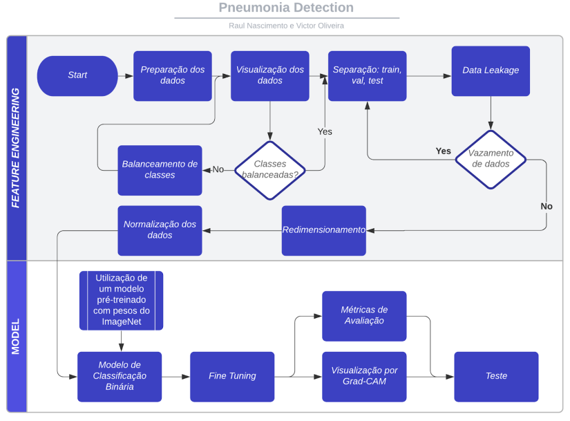

# Pneumonia Detection
Detection of pneumonia in pediatric patients.

By: Victor Hugo Rocha de Oliveira and Raul Nascimento

## Grad CAM
<h1 align="center">
  
</h1>

<h1 align="center">
  
</h1>

## Results

<h1 align="center">
  
</h1>

## Workflow

<h1 align="center">
  
</h1>

### :computer: Features

- [x] Data extraction;
- [x] Data cleaning;
- [x] Data analysis;
- [x] DAta Preprocessing;
- [x] Deep Learning Model;
- [x] Metrics Analysis;
- [X] Grad-CAM Visualization;

### 🛠 Tools

- [Python](https://www.python.org/)
- [TensorFlow](https://www.tensorflow.org/?hl=pt-br)
- [Keras](https://keras.io/)
